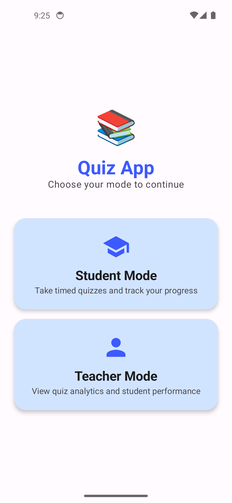
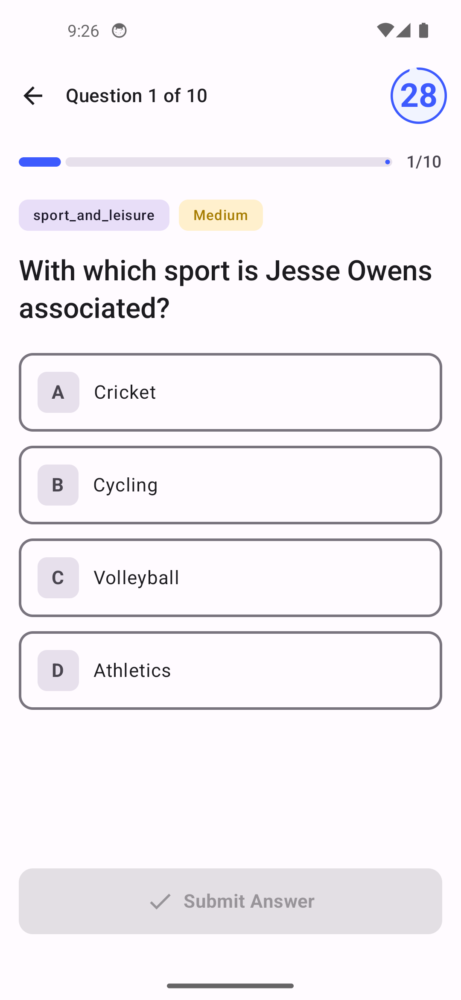
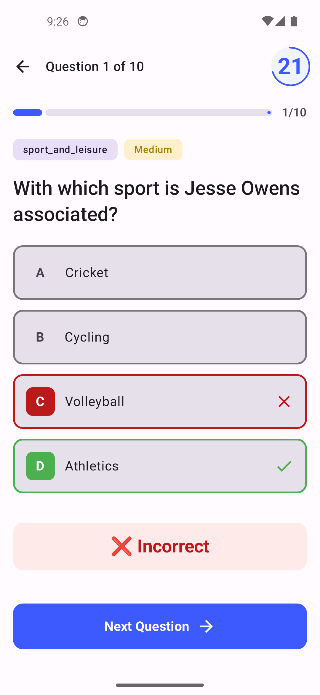
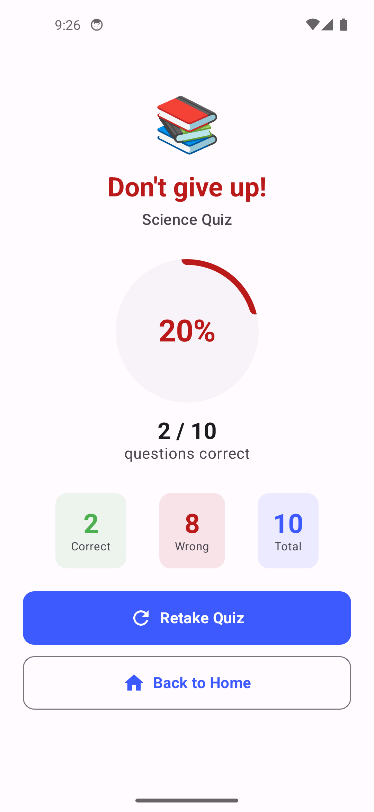
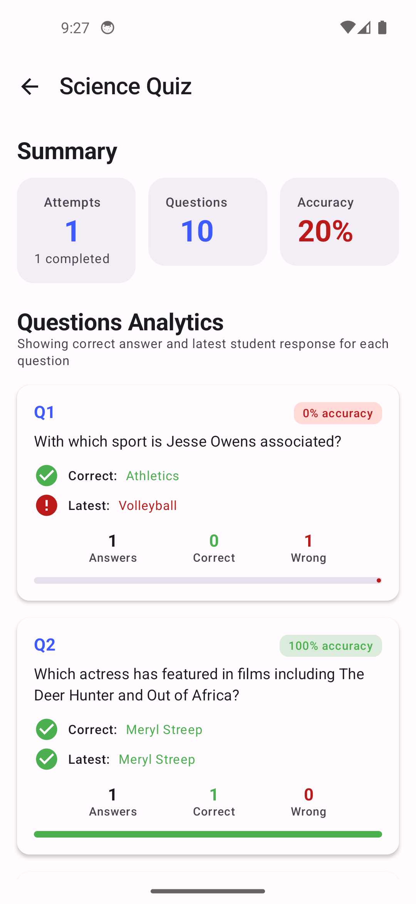
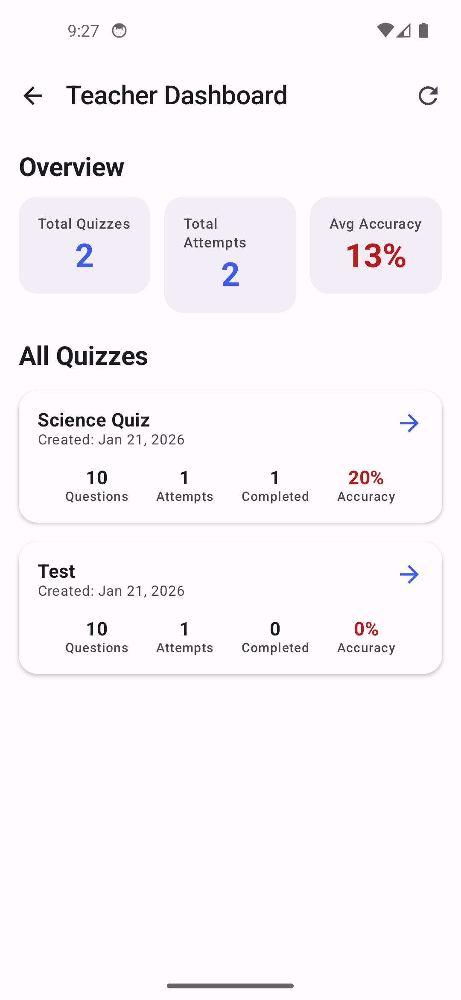

# Quiz Application

A modern Android Quiz Application built with **Jetpack Compose** following **Clean Architecture** and **MVI pattern**. The app supports two modes: **Student Mode** for taking quizzes with timed questions, and **Teacher Mode** for viewing quiz analytics.

## � Screenshots

| Mode Selection | Quiz Name Input | Quiz Play |
|:-------------:|:---------------:|:---------:|
|  |  |  |

| Answer Result | Quiz Result | Teacher Dashboard |
|:-------------:|:-----------:|:-----------------:|
|  |  |  |

| Quiz Analytics |
|:--------------:|
|  |

## 📱 Features

### Student Mode
- Enter a quiz name to start a new quiz session
- Fetches 10 questions from the Trivia API
- One question displayed at a time with countdown timer (30 seconds each)
- Timer survives screen rotation/recomposition
- Multiple quiz attempts supported
- Results screen with score and attempt history
- Option to retake quizzes

### Teacher Mode
- View analytics for all cached quizzes (no API calls)
- See correct answers for each question
- View student's selected answers (latest attempt)
- Per-question and per-quiz accuracy percentages
- Total attempts count and overall statistics

## ✅ Requirements Checklist

### Student Mode Requirements
- [x] Student starts by entering a Quiz Name
- [x] Fetch 10 questions from API on quiz start
- [x] Cache questions in Room database
- [x] One question at a time display
- [x] Countdown timer for each question
- [x] Submission locks when timer ends
- [x] Multiple quiz attempts supported
- [x] Each attempt stores: timestamp, selected answers, correct/incorrect result

### Teacher Mode Requirements
- [x] Display quiz name
- [x] All questions grouped under the quiz
- [x] Correct answer shown for each question
- [x] Student-selected answer (latest attempt) shown
- [x] Total number of attempts displayed
- [x] Correct vs wrong count per question
- [x] Accuracy percentage per question
- [x] Teacher mode only reads cached data (no API calls)

### Technical Constraints
- [x] Language: Kotlin
- [x] UI: Jetpack Compose only (no XML)
- [x] Min SDK: 24+
- [x] Shared ViewModel state between modes
- [x] Timer survives recomposition and screen rotation

## 🏗️ Architecture

The application follows **Clean Architecture** principles with clear separation of concerns:

```
app/
├── core/                  # Cross-cutting concerns
│   ├── common/           # Result, AppError, UiText wrappers
│   ├── constants/        # App constants
│   └── di/               # Hilt dependency injection modules
│
├── data/                  # Data layer
│   ├── local/            # Room database, entities, DAOs
│   ├── remote/           # Retrofit API service, DTOs
│   ├── mapper/           # Data transformation mappers
│   └── repository/       # Repository implementations
│
├── domain/                # Domain layer
│   ├── model/            # Business models
│   ├── repository/       # Repository interfaces
│   └── usecase/          # Business logic use cases
│
├── presentation/          # Presentation layer
│   ├── navigation/       # Navigation routes and host
│   ├── components/       # Reusable UI components
│   └── screens/          # Screen composables and ViewModels
│
└── ui/theme/             # Design system (colors, typography, theme)
```

### MVI Pattern

Each screen follows the **MVI (Model-View-Intent)** pattern:

```kotlin
// Contract defines the state and events
interface ScreenContract {
    data class State(...)      // Immutable UI state
    sealed interface Event { } // User intents/events
    sealed interface Effect { } // One-time side effects
}

// ViewModel processes events and emits state
@HiltViewModel
class ScreenViewModel : ViewModel() {
    private val _state = MutableStateFlow(State())
    val state: StateFlow<State> = _state.asStateFlow()
    
    private val _effect = Channel<Effect>()
    val effect = _effect.receiveAsFlow()
    
    fun onEvent(event: Event) { ... }
}
```

## 📊 Quiz Attempts Modeling

### Database Schema

```
┌─────────────────┐
│   QuizEntity    │
├─────────────────┤
│ id (PK)         │
│ name            │
│ createdAt       │
└────────┬────────┘
         │
         │ 1:N
         ▼
┌─────────────────┐     ┌─────────────────┐
│ QuestionEntity  │     │  AttemptEntity  │
├─────────────────┤     ├─────────────────┤
│ id (PK)         │     │ id (PK)         │
│ quizId (FK)     │◄────│ quizId (FK)     │
│ questionText    │     │ startedAt       │
│ correctAnswer   │     │ completedAt     │
│ incorrectAnswers│     │ score           │
│ category        │     │ totalQuestions  │
│ difficulty      │     │ isComplete      │
└─────────────────┘     └────────┬────────┘
                                 │
                                 │ 1:N
                                 ▼
                        ┌─────────────────┐
                        │  AnswerEntity   │
                        ├─────────────────┤
                        │ id (PK)         │
                        │ attemptId (FK)  │
                        │ questionId (FK) │
                        │ selectedAnswer  │
                        │ isCorrect       │
                        │ answeredAt      │
                        └─────────────────┘
```

### Key Design Decisions

1. **One-to-Many Relationships**: Each quiz can have multiple attempts, and each attempt stores individual answers.

2. **Answer Tracking**: Every answer is stored with:
   - The selected option
   - Whether it was correct
   - Timestamp when answered

3. **Attempt Completion**: An attempt tracks:
   - Start and completion timestamps
   - Final score
   - Total questions count
   - Completion status flag

4. **Quiz Reusability**: Questions are cached per quiz name. If a student starts a quiz with the same name, cached questions are used (avoiding API calls).

## ⏱️ Timer State Management

The timer is a critical feature that must survive configuration changes (rotation, recomposition).

### Implementation Strategy

```kotlin
@HiltViewModel
class QuizPlayViewModel @Inject constructor(
    private val savedStateHandle: SavedStateHandle,
    // ...
) : ViewModel() {

    // Timer state saved to SavedStateHandle
    private val _timeRemaining = savedStateHandle.getStateFlow(
        KEY_TIME_REMAINING, 
        DEFAULT_QUESTION_TIME_SECONDS
    )
    
    private fun startTimer() {
        timerJob?.cancel()
        timerJob = viewModelScope.launch {
            while (_timeRemaining.value > 0) {
                delay(TIMER_TICK_INTERVAL_MS)
                val newTime = _timeRemaining.value - 1
                savedStateHandle[KEY_TIME_REMAINING] = newTime
            }
            // Timer expired - auto-submit as incorrect
            handleTimerExpired()
        }
    }
}
```

### Key Mechanisms

1. **SavedStateHandle**: The remaining time is stored in `SavedStateHandle`, which survives process death and configuration changes.

2. **Coroutine-based Timer**: Uses `viewModelScope.launch` with `delay()` for tick intervals (100ms for smooth UI updates).

3. **Auto-submit on Expiry**: When timer reaches zero, the current question is automatically marked as incorrect.

4. **Question Transition**: Timer resets to 30 seconds when moving to the next question.

5. **State Restoration Flow**:
   ```
   Rotation occurs
         │
         ▼
   ViewModel survives (Hilt scoped)
         │
         ▼
   SavedStateHandle restores timeRemaining
         │
         ▼
   Timer continues from saved value
   ```

## 👥 Multi-Student Scaling

To support multiple students with their own quiz sessions, the following changes would be needed:

### 1. Add Student Entity

```kotlin
@Entity(tableName = "students")
data class StudentEntity(
    @PrimaryKey val id: String = UUID.randomUUID().toString(),
    val name: String,
    val email: String?,
    val createdAt: Long = System.currentTimeMillis()
)
```

### 2. Update Attempt Entity

```kotlin
@Entity(
    tableName = "attempts",
    foreignKeys = [
        ForeignKey(entity = QuizEntity::class, ...),
        ForeignKey(entity = StudentEntity::class, ...)  // Add FK
    ]
)
data class AttemptEntity(
    // ... existing fields
    val studentId: String  // Add this field
)
```

### 3. Add Student Authentication

- Implement login/registration screens
- Store current student ID in session
- Filter attempts by student ID in queries

### 4. Enhanced Analytics

```kotlin
// Per-student analytics
@Query("""
    SELECT * FROM attempts 
    WHERE quizId = :quizId AND studentId = :studentId
    ORDER BY startedAt DESC
""")
fun getStudentAttempts(quizId: String, studentId: String): Flow<List<AttemptEntity>>

// Class-wide analytics for teacher
@Query("""
    SELECT AVG(CAST(score AS FLOAT) / totalQuestions * 100) 
    FROM attempts WHERE quizId = :quizId
""")
fun getQuizAverageScore(quizId: String): Flow<Float>
```

### Migration Strategy

1. **Phase 1**: Add offline-first sync layer
   - Keep Room as primary storage
   - Sync in background when online

2. **Phase 2**: Move business logic
   - Server-side attempt validation
   - Centralized analytics

3. **Phase 3**: Real-time features
   - WebSocket for live quiz sessions
   - Push notifications for results

## 🌐 Backend Migration Logic

When moving from local-only to a cloud-based architecture, the following logic should migrate to the backend:

### 1. Authentication & Authorization
- User registration and login
- Session management with JWT tokens
- Role-based access (Student/Teacher)

### 2. Quiz Management
- Quiz creation and question storage
- Centralized question bank
- Quiz assignment to students/classes

### 3. Attempt Storage & Validation
- Server-side answer submission with timestamp validation
- Prevent timer manipulation/cheating
- Centralized attempt storage for all students

### 4. Analytics Aggregation
- Real-time analytics computation
- Class-wide performance metrics
- Historical trend analysis

### 5. Real-time Timer Synchronization
- Server validates timing to prevent cheating
- Synchronized quiz sessions for all students

## 🛠️ Tech Stack

| Category | Technology |
|----------|------------|
| UI | Jetpack Compose, Material 3 |
| Architecture | Clean Architecture, MVI |
| DI | Hilt |
| Database | Room |
| Networking | Retrofit, OkHttp |
| Navigation | Navigation Compose |
| Async | Kotlin Coroutines, Flow |
| Serialization | Kotlin Serialization, Gson |

## 🚀 Getting Started

### Prerequisites

- Android Studio Hedgehog or newer
- JDK 17
- Android SDK 35

### Build & Run

```bash
# Clone the repository
git clone <repository-url>

# Open in Android Studio and sync Gradle

# Run on emulator or device
./gradlew installDebug
```

### API

The app uses the **Open Trivia Database v2 API**:
```
GET https://the-trivia-api.com/v2/questions?limit=10
```

No API key required.

## 📝 License

This project is for educational/assessment purposes.

## 📥 Download

[Download Debug APK](release/app-debug.apk)

---

Built with ❤️ using Jetpack Compose
